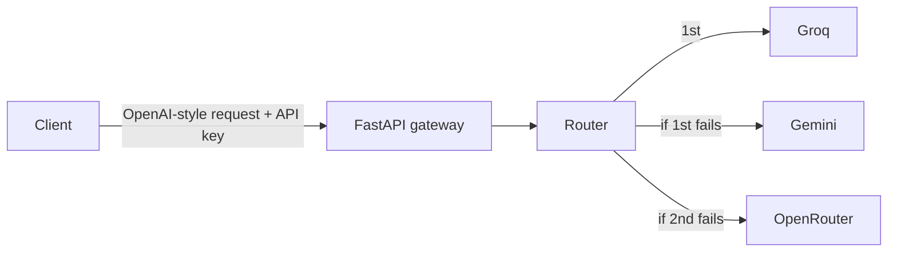

[](https://github.com/kjibran/llm-gateway/actions/workflows/ci.yaml)

# LLM Gateway

An OpenAI-compatible API gateway that routes chat requests across free LLM providers (Groq, Google Gemini, OpenRouter) and falls back automatically when a provider is rate-limited, overloaded, or unavailable.

**Try it in your browser:** https://huggingface.co/spaces/khajlk/llm-gateway-demo

**Live API docs:** https://llm-gateway-2k0v.onrender.com

The service runs on a free tier, so the first request after idle time can take up to a minute while it wakes up.

## Why this exists

Free LLM tiers are useful for prototyping but unreliable. During development I saw every kind of failure: a model retired without notice, a free model moved behind a paywall, providers returning 503 under high demand, and upstream rate limits (429). An application that depends on one provider breaks whenever that provider does.

The gateway puts one stable endpoint in front of several providers. Clients send a standard OpenAI-style request, and the gateway tries providers in order until one answers.

## What this project demonstrates

- **LLM API integration:** working with multiple LLM providers through OpenAI-compatible APIs, including model selection and handling provider-specific differences.
- **Resilient system design:** automatic fallback, timeout handling, and structured error reporting when upstream services fail.
- **API development:** an async REST API in FastAPI with request validation and bearer-token authentication.
- **Testing:** unit tests with fake providers to verify fallback behaviour without calling real services.
- **CI/CD:** GitHub Actions pipeline with linting, formatting checks, and tests, deploying to production only when all checks pass.
- **Containerisation and deployment:** Docker image deployed to Render, configured through environment variables.
- **Secrets management:** API keys kept out of the code and repository, supplied as environment variables locally, in CI, and in production.

## Architecture



## How it works

- `POST /v1/chat/completions` accepts the same request format as the OpenAI API, so existing OpenAI clients can point at the gateway.
- The router tries providers in the configured order. A timeout, network error, or non-200 response counts as a failure and moves on to the next provider.
- Every attempt is recorded with provider name, latency, and error. The response includes two headers: `X-Gateway-Provider` (which provider answered) and `X-Gateway-Attempts` (how many tries it took).
- If every provider fails, the gateway returns a 503 with the full list of attempts, so the cause of each failure is visible.
- The chat endpoint requires a bearer token. `/health` is public.

## Example

```bash
curl -s https://llm-gateway-2k0v.onrender.com/v1/chat/completions \
  -H "Content-Type: application/json" \
  -H "Authorization: Bearer YOUR_GATEWAY_KEY" \
  -d '{"messages":[{"role":"user","content":"Say hi in five words."}]}'
```

## Design decisions

- **One provider class, three configurations.** Groq, Gemini, and OpenRouter all offer OpenAI-compatible endpoints, so a single `Provider` class covers all three. Adding a provider is a few lines of configuration, not a new integration.
- **One failure type.** Every provider error is converted to `ProviderError`. The router only needs to catch that one exception to decide when to fall back.
- **Models live in configuration.** Free models change often. Keeping model names in environment variables means a retired model is a config change, not a code change.
- **Missing keys are skipped, not fatal.** A provider without a key or model is left out of the rotation, so the gateway still runs with partial configuration.
- **Response bodies pass through unchanged.** Gateway metadata goes in headers, so clients get the provider's normal response.

## Run locally

Requires [uv](https://docs.astral.sh/uv/).

```bash
git clone https://github.com/kjibran/llm-gateway.git
cd llm-gateway
cp .env.example .env    # then add your API keys
uv sync
uv run uvicorn llm_gateway.main:app --reload
```

Open http://localhost:8000/docs.

With Docker:

```bash
docker build -t llm-gateway .
docker run --rm -p 7860:7860 --env-file .env llm-gateway
```

## Testing and CI/CD

Tests use fake providers, so they run in under a second and never call real APIs. They cover the normal path, fallback after a failure, the all-providers-failed case, skipping unconfigured providers, and API key protection.

```bash
uv run pytest -v
```

On every push to `main`, GitHub Actions runs linting (ruff), a formatting check, and the tests. Only if all pass does it trigger a deploy to Render through a deploy hook. Code that fails CI never reaches production.

## Limitations and next steps

- **Retry logic:** a 429 or 503 is often temporary and worth one retry, while a 404 never is. The router currently treats all failures the same.
- **Cooldown:** a provider that keeps failing still costs time on every request. A short cooldown after repeated failures would skip it.
- **Response normalisation:** providers add their own extra fields (Groq returns reasoning text, Gemini returns a thought signature). A normalised response shape would make clients simpler.
- **Per-provider options:** for example, lower reasoning effort on reasoning models to save latency and quota.
- **Streaming** is not supported yet.
- **Rate limiting per client** is not implemented. The API key is the only access control.

## Tech stack

Python 3.12, FastAPI, httpx, pydantic-settings, pytest, ruff, uv, Docker, GitHub Actions, Render.